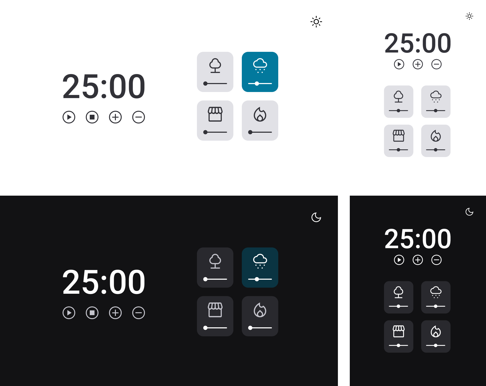

<h1 align="center">
	Focus Timer 2.0
</h1>

<h3 align="center">
	Project created for focus based on Pomodoro with Dark Mode
</h3>

<h4 align="center">
	Status: 🚀 Finished
</h4>

  

## About

EN = This project aims to put into practice JavaScript, HTML and CSS, where a timer was created based on the Pomodoro technique with Dark Mode, it was developed in the Rocketseat Explorer program class.

PT = Esse projeto tem como finalidade colocar em prática JavaScript, HTML e CSS, aonde foi criado um temporazidor baseado na técnica Pomodoro com Dark Mode, ele foi elaborado na aula do programa Explorer da Rocketseat.

## Tech Stack

<a href="https://developer.mozilla.org/pt-BR/docs/Web/CSS" target="_blank">&nbsp;</a>
<a href="https://developer.mozilla.org/pt-BR/docs/Web/HTML" target="_blank">&nbsp;</a>
<a href="https://developer.mozilla.org/pt-BR/docs/Web/JavaScript" target="_blank">&nbsp;</a>

## Layout

In the links below you will find the layout of the web project and also the mobile one. Remembering that you need to have an account on [Figma](http://figma.com/) to access it.

[Layout Web / Mobile](<https://www.figma.com/file/Gu1pBI6IR0ZI0lIiyB8mHH/Stage-05---Dark-Mode-FocusTimer-(Copy)?node-id=0%3A1>)
